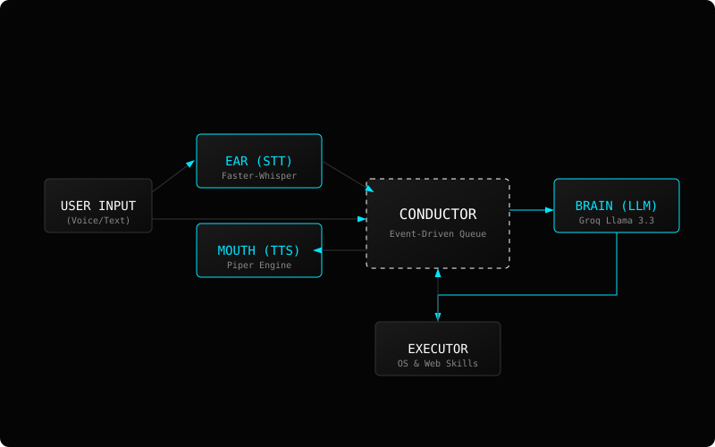

# Jarvis — AI Automation Assistant (Windows)

While growing up I was amazed when I saw **Iron Man** and I'm damn sure you had too, and you know **Tony** was kind of a vibe-coder as well — he was the force behind everything. He had some great visions and **Jarvis** helped him achieve it.

**TONY STARK BUILT THIS IN A CAVE, WITH A BOX OF SCRAPS!**

Well, here I am building my own **Jarvis** from scratch, leveraging everything I can — because why not?

---

## Dataflow Representation



---

## Core Architecture: Session-Based

Jarvis is a stateful assistant for Windows that bridges the gap between natural language and system control using a continuous interaction model.

### How it Works:

*   **Continuous Sessions:** Wake-word activation starts a 30-second window for back-and-forth dialogue without repeating the name.
*   **Persistent Audio:** The microphone stream remains open during sessions to eliminate hardware startup lag.
*   **Neural Reasoning:** Powered by **Groq (Llama 3.3 70B)**, Jarvis generates structured plans for OS and Web tasks.
*   **Synchronous Execution:** A sequential flow (Think -> Act -> Speak) prevents hardware conflicts and echo loops.
*   **Subconscious Persistence:** SQLite-backed memory for user preferences and session summaries.

---

## Essential Assets

Large models and assets are not tracked. Configure these manually:

1.  **TTS Voice Model**: Download the [Northern English Male](https://huggingface.co/rhasspy/piper-voices/resolve/main/en/en_GB/northern_english_male/medium/en_GB-northern_english_male-medium.onnx) Piper model to `resources/voices/`.
2.  **API Configuration**: Create a `.env` file in the root directory:
    ```env
    PORCUPINE_ACCESS_KEY=your_key_here
    GROQ_API_KEY=your_key_here
    ```

---

## Quick Start

### Setup
```bash
.\scripts\bootstrap.ps1
```

### Run
```bash
python jarvis.py
```

---

## Project Structure

```
Jarvis/
├── jarvis.py                     # Orchestrator
├── src/                          
│   ├── core/                     # Session, Memory, EventBus
│   ├── engine/                   # Ear, Brain, Mouth
│   ├── skills/                   # System & Web Primitives
│   └── ui/                       # Dashboard & Widgets
├── resources/                    # Icons, Sounds, Models
└── scripts/                      # Bootstrap utilities
```

---

## License

Released under the MIT License.

**"Sometimes you gotta run before you can walk."** — Tony Stark